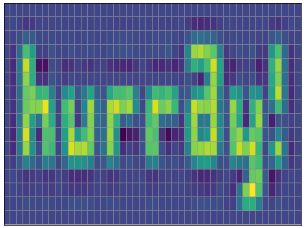

.. Hurray documentation master file, created by
   sphinx-quickstart on Tue Aug 16 10:28:41 2016.
   You can adapt this file completely to your liking, but it should at least
   contain the root `toctree` directive.

Hurray – a server for array data
================================

Quickstart
##########

Install and start the hurray server::

    $ pip install git+https://github.com/meteotest/hurray.git
    $ hurray
    [I 170131 00:09:40 __main__:128] Listening on localhost:2222
    [I 170131 00:09:40 process:132] Starting 12 processes

Install the hurray client package::

    $ pip install git+https://github.com/meteotest/hurray-py.git

Start an ipython/python shell and connect to the hurray server:

.. code-block:: ipython

    In [1]: import hurraypy as hr

    In [2]: conn = hp.connect('localhost', '2222')

Now you're ready to create files, groups, and arrays (called "datasets"):

.. code-block:: ipython

    In [3]: conn.create_file("test.h5")

    In [4]: f = conn.use_file("test.h5")

    In [5]: f.create_group("/data")
    Out[5]: <HDF5 Group (db=test.h5, path=/data)>

    In [6]: grp = f["/data"]

    In [7]: import numpy as np

    In [8]: arr = np.random.random((400, 300))

    In [9]: dataset = grp.create_dataset("myarray", data=arr)

    In [10]: dataset.shape
    Out[10]: (400, 300)

    In [11]: dataset.dtype
    Out[11]: 'float64'

You can retrieve data using familiar NumPy syntax.

.. code-block:: ipython

    In [12]: dataset[:]
    Out[12]: array([[ 0.22309977,  0.22696059,  0.39669007, ...,  0.10220055,
                      0.53091305,  0.16883515],
                    [ 0.56145178,  0.4425107 ,  0.22402512, ...,  0.99954642,
                      0.80709289,  0.35570268],
                    [ 0.40499767,  0.59344728,  0.52269062, ...,  0.62949525,
                      0.67829918,  0.78454277],
                    ..., 
                    [ 0.72620273,  0.33525975,  0.15172425, ...,  0.04085315,
                      0.15373999,  0.04217979],
                    [ 0.43795463,  0.92673444,  0.6299503 , ...,  0.22689763,
                      0.73296667,  0.71055739],
                    [ 0.6304112 ,  0.75745183,  0.42235604, ...,  0.08328294,
                      0.51188761,  0.0506138 ]])

Slicing and fancy indexing allow partial reading and broadcasting:

.. code-block:: ipython

    In [13]: dataset[0, 0:3] = 999

    In [14]: dataset[0, 0:4]  # only an array of length 4 is transferred
    Out[14]: array([  9.99000000e+02,   9.99000000e+02,   9.99000000e+02,
                      3.72972583e-01])

Contents:

.. toctree::
   :maxdepth: 2

Indices and tables
==================

* :ref:`genindex`
* :ref:`modindex`
* :ref:`search`

